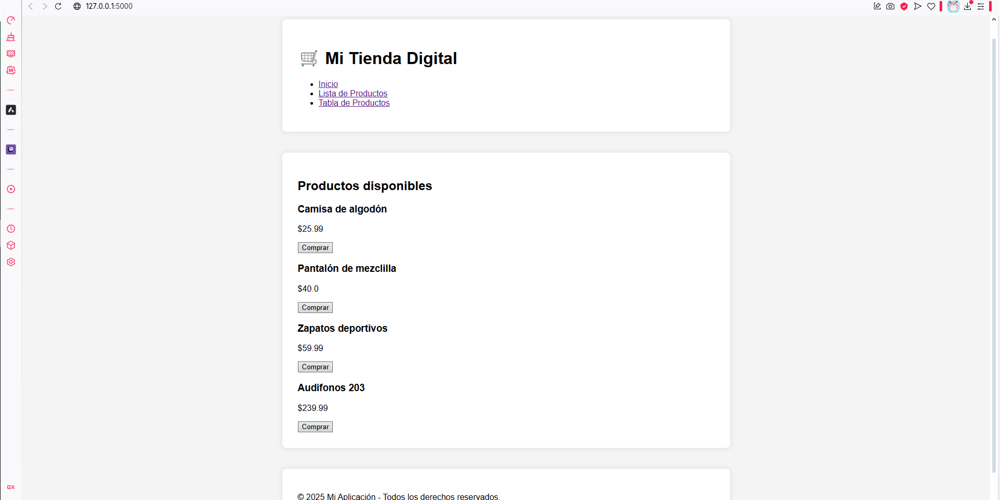
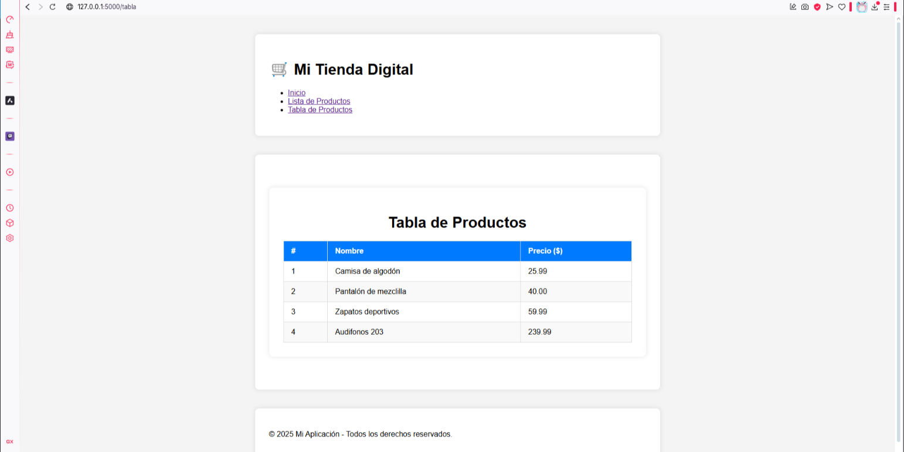
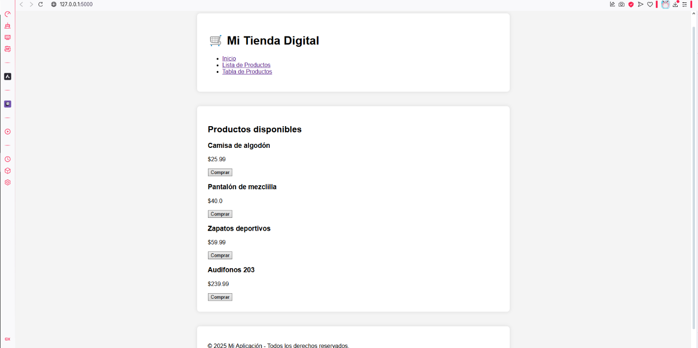

# COMP 2052 -- Server-Side Web Development and Back-End Microservices

Autor: Emmanuel A. Arguelles Ocasio

Fecha: 20 de abril de 2025

## 🏠 Pantalla de Inicio{width="6.75in" height="3.375in"}

Descripción:\
La pantalla principal muestra una cuadrícula con los productos
disponibles. Cada producto incluye su nombre, precio y un botón de
compra.

Funcionalidad:\
Los datos de los productos se cargan dinámicamente desde el archivo
productos.json en el Back-End y se renderizan en esta plantilla
utilizando Jinja2.

Ruta:\
http://127.0.0.1:5000/

## 📊 Pantalla de Tabla de Productos{width="6.666666666666667in" height="3.3333333333333335in"}

Descripción:\
Esta pantalla muestra los productos en formato de tabla, con columnas
para el número, nombre y precio de cada producto.

Funcionalidad:\
Los datos se cargan dinámicamente desde el archivo JSON y se organizan
en una tabla HTML.

Ruta:\
http://127.0.0.1:5000/tabla

## 📋 Pantalla de Lista de Productos{width="6.777155511811023in" height="3.386178915135608in"}

Descripción:\
Esta pantalla muestra los productos en formato de lista, con solo el
nombre de cada producto.

Funcionalidad:\
Los datos se cargan dinámicamente desde el archivo JSON y se renderizan
como una lista HTML.

Ruta:\
http://127.0.0.1:5000/lista

## 🧪 Pruebas de API

Descripción:\
Se realizaron pruebas para las rutas del API utilizando los archivos
.rest en la carpeta test. Estas pruebas verifican las operaciones de
creación, actualización, eliminación y obtención de productos.

Rutas probadas:\
- GET /productos\
- POST /productos\
- PUT /productos\
- DELETE /productos{width="6.583333333333333in"
height="3.2916666666666665in"}{width="6.576842738407699in"
height="3.2884219160104986in"}{width="6.541666666666667in"
height="3.2708333333333335in"}{width="6.559787839020123in"
height="3.2798939195100614in"}

## 💡 Reflexión

Separación entre Back-End y Front-End:\
La separación entre Back-End y Front-End permite mantener el código
organizado y escalable. El Back-End maneja la lógica y los datos,
mientras que el Front-End se encarga de la presentación. Esto facilita
el mantenimiento y la colaboración en proyectos más grandes.

## 🔗 Enlace al Repositorio

GitHub:\
https://github.com/RyogaAqua/comp2052
