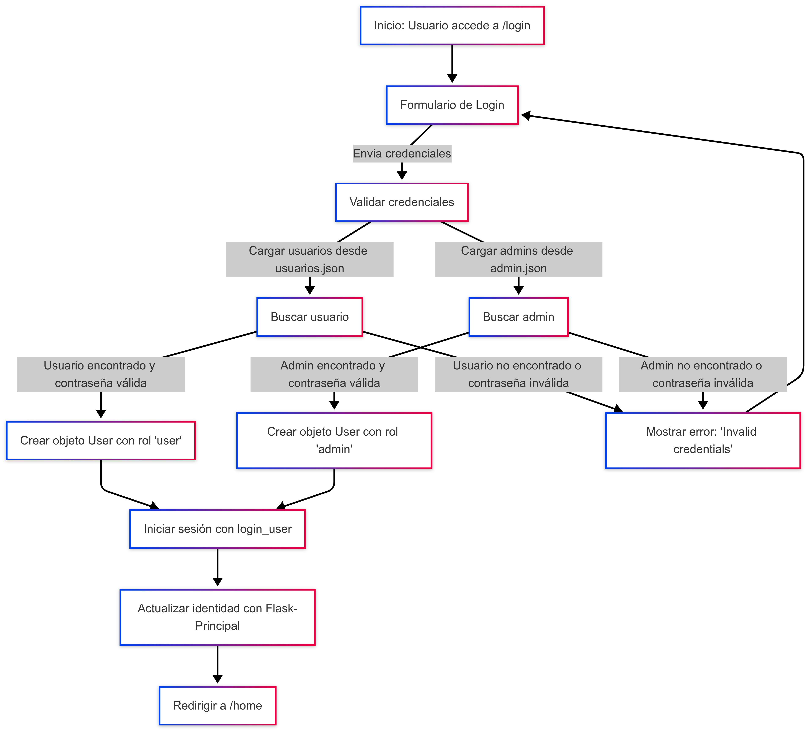
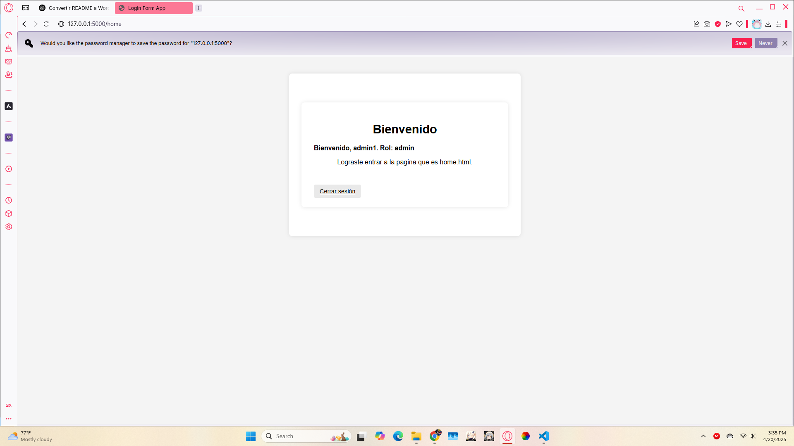
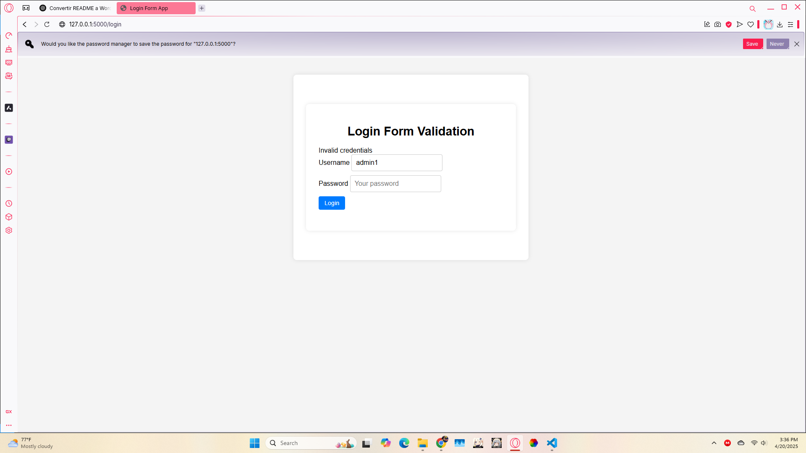

# COMP 2052 -- Sistema de Autenticación y Autorización con Flask

Autor: Emmanuel A. Arguelles Ocasio  
Fecha: 20 de abril de 2025  

## 📋 Descripción del Proyecto

Este proyecto es una aplicación Flask que implementa un sistema de autenticación y autorización basado en roles (`user` y `admin`). El objetivo principal es proteger rutas específicas según los permisos asignados a cada rol, utilizando Flask-Principal y Flask-Login. Además, se incluyen funcionalidades para el manejo de contraseñas hasheadas y una interfaz de usuario básica.

## 🚀 Funcionalidades Principales

1. **Autenticación y Autorización**:
   - Inicio de sesión con validación de credenciales.
   - Roles definidos: `user` y `admin`.
   - Protección de rutas según permisos.

2. **Hashing de Contraseñas**:
   - Contraseñas almacenadas de forma segura utilizando `werkzeug.security.generate_password_hash`.

3. **Rutas Implementadas**:
   - `/`: Redirige al formulario de inicio de sesión.
   - `/login`: Maneja el inicio de sesión.
   - `/home`: Página de bienvenida tras iniciar sesión.
   - `/admin`: Ruta exclusiva para administradores.
   - `/user`: Ruta exclusiva para usuarios estándar.
   - `/logout`: Cierra la sesión del usuario.

4. **Interfaz de Usuario**:
   - Diseño responsivo utilizando CSS.
   - Mensajes de error y éxito mostrados dinámicamente en la interfaz.

## 📂 Estructura del Proyecto

El proyecto está organizado de la siguiente manera:

- **`app.py`**: Archivo principal que define las rutas y la lógica de autenticación.
- **`templates/`**: Contiene las plantillas HTML para las vistas.
- **`static/css/`**: Contiene los estilos CSS.
- **`data/`**: Archivos JSON que almacenan los usuarios y administradores.
- **`hashear_usuarios.py` y `hashear_admin.py`**: Scripts para hashear las contraseñas de usuarios y administradores.

### Diagrama de Flujo

## 🧪 Pruebas Realizadas

Se realizaron pruebas manuales para verificar el correcto funcionamiento de las rutas y permisos. A continuación, se describen algunos casos de prueba:

### Pruebas de Inicio de Sesión
- **Inicio de sesión exitoso**:
  
  

- **Inicio de sesión fallido**:
  

### Pruebas de Acceso a Rutas
- **Acceso permitido**:
  - Usuarios pueden acceder a `/user`.
  - Administradores pueden acceder a `/admin`.

- **Acceso denegado**:
  

## 🌐 Rutas del Proyecto

1. **Página Principal** (`/`):
   - Redirige al formulario de inicio de sesión.

2. **Inicio de Sesión** (`/login`):
   - Procesa las credenciales ingresadas por el usuario.
   - Redirige a `/home` si las credenciales son válidas.

3. **Página de Bienvenida** (`/home`):
   - Muestra un mensaje de bienvenida con el rol del usuario autenticado.

4. **Ruta Exclusiva para Administradores** (`/admin`):
   - Accesible solo para usuarios con rol `admin`.

5. **Ruta Exclusiva para Usuarios** (`/user`):
   - Accesible solo para usuarios con rol `user`.

6. **Cerrar Sesión** (`/logout`):
   - Cierra la sesión del usuario y redirige al formulario de inicio de sesión.

## 🔗 Enlace al Repositorio

GitHub:  
[https://github.com/RyogaAqua/comp2052](https://github.com/RyogaAqua/comp2052)